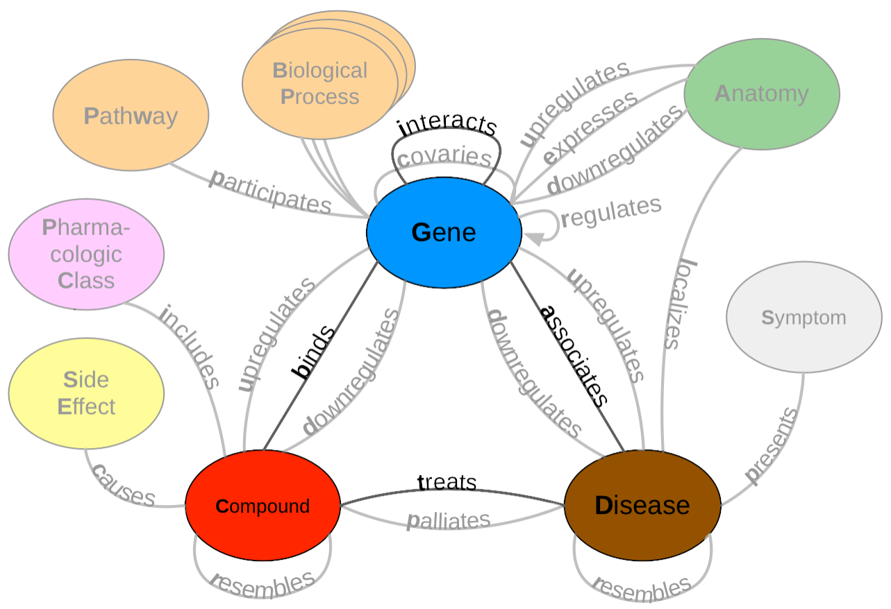

# Materials and Methods
## Hetionet
Hetionet [@doi:10.7554/eLife.26726] is a large heterogenous network that contains pharmacological and biological information.
This network depicts information in the form of nodes and edges of different types: nodes that represent biological and pharmacological entities and edges which represent relationships each entity may share with itself or another. 
Currently, Hetionet contains 47,031 nodes with 11 different data types and 2,250,197 edges that represent 24 different relationship types (Figure 1).
Edges in Hetionet were obtained from open databases, such as the GWAS Catalog [@doi:10.1093/nar/gkw1133], DrugBank [@doi:10.1093/nar/gkw1133].
For this project, we analyzed performance over a subset of the Hetionet relationship types: disease associates with a gene (DaG), compounds binding to a gene (CbG), gene interacts with gene (GiG) and compound treating a disease (CtD).

Figure 1. A metagraph (schema) of Hetionet where pharmacological, biological and disease entities are represented as nodes and the relationships between them are represented as edges.

## Dataset
We used PubTator [@doi:10.1093/nar/gkt441] as input to our analysis.
PubTator provides medline abstracts that have been annotated with well-established entity recognition tools including DNorm [@doi:10.1093/bioinformatics/btt474], GeneTUKit [@doi:10.1093/bioinformatics/btr042] Gnorm [@doi:10.1186/1471-2105-12-S8-S5] and a dictionary based look system for compound mentions [@doi:10.1093/database/bas037].
We downloaded PubTator on June 30, 2017, at which point it contained 10,775,748 abstracts. 
Then we filtered out mention tags that were not contained in hetionet.
We used the Stanford CoreNLP parser [@doi:10.3115/v1/P14-5010] to tag parts of speech and generate dependency trees.
We extracted sentences with two or more mentions, termed candidate sentences.
Each candidates sentence was stratified by co-mention pair to produce a training set, tuning set and a testing set (shown in Table 1).
Sentences that contain more than one co-mention pair are treated as multiple individual candidates.
We hand labeled five hundred to a thousand candidate sentences of each relationship to obtain to obtain a ground truth set (Table 1).

| Relationship | Train | Tune | Test |
| :--- | :---: | :---: | :---: |
| Disease Associates Gene | 2.35 M |31K (397+, 603-) | 313K (351+, 649-) |
| Compound Binds Gene | 1.7M | 468K (37+, 463-) | 227k (31+, 469-) |
| Compound Treats Disease | 1.013M | 96K (96+, 404-) | 32K (112+, 388-) |
| Gene Interacts Gene | 12.6M | 1.056M (60+, 440-) | 257K (76+, 424-) |

Table 1. Statistics of Candidate Sentences. Numbers in parentheses show the number of positives and negatives that resulted from the hand-labeling process.

## Label Functions
describe what a label function is and how many we created for each relation

## Training Models
### Generative Model
talk about generative model and how it works
### Word Embeddings
mention facebooks fasttext model and how we used it to train word vectors
### Discriminator Model
talk about the discriminator model and how it works
### Discriminator Model Calibration
talk about calibrating deep learning models with temperature smoothing

## Experimental Design
talk about sampling experiment
